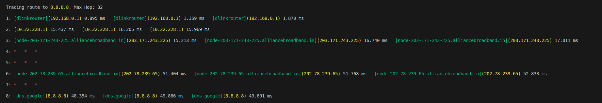
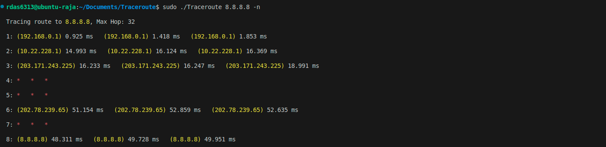

# Traceroute

A lightweight **Traceroute implementation in C** that shows the route to a target **IP** with colorful output and customizable options.  
Built for learning and debugging network paths with user-friendly features.  

## Features

- Trace routes to IP
- Colorful output for readability
- Skip DNS lookups with -n
- Custom timeout, port, and hop limit
- Error reporting with -e
- Educational tool for learning ICMP, UDP, TTL behavior

## Requirements
- **GCC 11.4** or above  
- **make**  
- Linux environment with **superuser permissions**  
## Installation

Install my-project with npm

```bash
# Clone or download this repository to your local machine
git clone https://github.com/rdas6313/Traceroute.git
cd Traceroute

# Build the project
make

# Run with superuser privileges
sudo ./Traceroute <options> <ip/domain>
```
    
## Usage/Examples

```bash
sudo ./Traceroute [OPTIONS] <target>

```
| Option | Description                                        |
| ------ | -------------------------------------------------- |
| `-n`   | Show route **without domain resolution** (IP only) |
| `-e`   | Enable detailed **error display**                  |
| `-t`   | Set **timeout** (in seconds) for probes            |
| `-p`   | Specify **destination port**                       |
| `-m`   | Define **maximum hop count**                       |

```bash
# Trace route to IP 8.8.8.8
sudo ./Traceroute 8.8.8.8

# With error display, 2s timeout, port 33434, and max 20 hops
sudo ./Traceroute -e -t 2 -p 33434 -m 20 8.8.8.8

```

## Screenshots




## Demo

[Watch the demo](https://www.youtube.com/watch?v=15efRh1fhAo)


